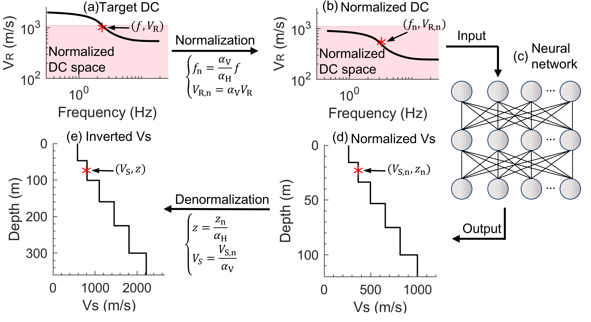

# U-SWIFT: A Unified Surface Wave Inversion Framework with Transformer

**U-SWIFT is a unified deep learning framework for inverting fundamental-mode Rayleigh-wave dispersion curves to obtain shear wave velocity (Vs) profiles.**

This repository contains the official implementation of the paper: "[U-SWIFT: A Unified Surface Wave Inversion Framework with Transformer via Normalization of Dispersion Curves]".

The key innovation of this framework is the normalization of dispersion curves based on their scaling properties. This allows a single, pre-trained model to robustly predict Vs profiles across diverse depth and velocity scales, from near-surface engineering applications to deep crustal imaging, without retraining.

## ✨ Key Features

**Scale Invariance**: By leveraging the normalization of dispersion curves based on their physical scaling properties, a single pre-trained model can be applied to inversion problems at vastly different scales—from shallow near-surface (<10m) to deep crustal levels—without any retraining.

**Variable-Length Input**: The framework incorporates a Transformer-based model (PADIT) that is specifically designed to process dispersion curves of varying lengths, eliminating the need for fixed-size inputs.

**Robust Uncertainty Quantification**: The framework can rapidly generate an ensemble of valid Vs profiles that fit the observed data, allowing for a robust and meaningful quantification of the inversion uncertainty.

**Simplified Workflow**: This approach eliminates the need for tedious manual parameterization (e.g., defining the number of layers). Users only need to provide a broad estimate for the half-space depth and velocity to obtain accurate results.

## ⚙️ How It Works: The U-SWIFT Workflow

The framework operates in a powerful five-step process, which is visualized below. This process decouples the inversion from the specific scale of the problem, allowing for a universally applicable model.

1.  **Estimate Scaling Factors**: The process begins by providing broad estimates for the half-space depth ($H_{hs}$) and S-wave velocity ($V_{S,hs}$). These can be initially constrained based on the properties of the experimental dispersion curve itself. Multiple pairs of these parameters are sampled to explore the solution space.

2.  **Normalization**: For each sampled pair, depth ($\alpha_{H}$) and velocity ($\alpha_{v}$) scaling factors are calculated. These factors are used to transform the target dispersion curve ($f, V_{R}$) into a predefined Normalized Dispersion Curve Space (NDCS).
   
$$\alpha_{H} = \frac{H_{0}}{H_{hs}}, \quad \alpha_{v} = \frac{V_{S0}}{V_{S,hs}}$$

$$f_{n} = \frac{\alpha_{v}}{\alpha_{H}}f, \quad V_{R,n} = \alpha_{v}V_{R}$$

3.  **AI-Powered Prediction**: The normalized dispersion curve ($f_n, V_{R,n}$) is then processed by the pre-trained U-SWIFT model, which instantly outputs a corresponding high-resolution normalized $V_S$ profile ($z_n, V_{S,n}$).

4.  **Denormalization**: The normalized profile is scaled back using the inverse of the scaling factors to yield a potential real-world inverted $V_S$ profile ($z, V_S$). This step is repeated for all sampled pairs to generate a large ensemble of potential solutions.

$$z = \frac{z_{n}}{\alpha_{H}}, \quad V_{S} = \frac{V_{S,n}}{\alpha_{v}}$$

5.  **Screening and Selection**: For each inverted $V_S$ profile in the ensemble, a theoretical dispersion curve is forward-calculated. The **misfit** between this theoretical curve and the original experimental curve is computed.
    * The profile with the **lowest misfit** is selected as the **best-fit model**.
    * All profiles with a misfit below a certain threshold (e.g., misfit < 1) are considered **valid models**. This collection of valid models provides a robust characterization of the solution's uncertainty.

## 🚀 Quick Start Guide

Follow these steps to download the necessary files and run an inversion.

### 1. Download and Prepare the Project

First, get all the required files from the official release page.

1.  Navigate to the project's [**Releases Page**](https://github.com/CTJ-UT/U-SWIFT-A-Unified-Surface-Wave-Inversion-Framework-with-Transformer/releases).
2.  From the latest release (e.g., `PADIT v1.0.0`), download all **three** essential items:
    * `Source code (zip)`
    * `aggregation_model.pth`
    * `aggregation_scaler.pkl`
3.  Unzip the `Source code (zip)` archive.
4.  Inside the newly unzipped directory, **create a new folder** named `models` if it does not already exist.
5.  **Move** the `aggregation_model.pth` and `aggregation_scaler.pkl` files into the `models` folder.

### 2. Install Dependencies

Before running, please ensure all required libraries are installed in your Python environment. The necessary packages and their recommended versions are listed in the `requirements.txt` file.

Please use your preferred package manager (e.g., `pip`, `conda`) to install these dependencies accordingly.

### 3. Run the Inversion

1.  Open and run the **`main.ipynb`** notebook.
2.  In the notebook, modify the path to point to your dispersion curve data file and set the estimation ranges for the half-space parameters ($H_{hs}$ and $V_{S,hs}$).
3.  Execute all cells to perform the inversion and visualize the results.
